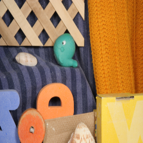

# End-to-End Learning of Motion Representation for Video Understanding

This repository contains implementation code for the project 'End-to-End Learning of Motion Representation for Video Understanding' (CVPR 2018). 

```http://lijiefan.me/project_webpage/TVNet_cvpr/index.html```

## Prerequisites
#### Tensorflow
We use tensorflow (https://www.tensorflow.org) for our implementation.

#### Matlab (optional)
We use `.mat` file for TVNet generated results saving, and `Matlab` for results [`visualization`](http://sintel.is.tue.mpg.de). 

## Installation
Our current release has been tested on Ubuntu 16.04.

#### Clone the repository
```
git clone https://github.com/LijieFan/tvnet.git
```

## Steps to run

#### I) Put input frames in `frame/img1.png`, `frame/img2.png`.

#### II) Use TVNet to generate motion representation 

The file (`demo.py`) has the following options:
- `-scale`: Number of scales in TVNet (default: 1)
- `-warp`: Number of warppings in TVNet (default: 1)
- `-iteration`: Number of iterations in TVNet(default: 50)
- `-gpu`: the gpu to run on (0-indexed, -1 for CPU)

Sample usages include
- Generate motion representation for frames in `frame/img1.png` and `frame/img2.png`.

```
python demo.py --scale 1 --warp 1 --iteration 50 --gpu 1
``` 

#### III) Check results and visualization

-TVNet generated results are saved in `result/result.mat`

-Use the MPI-Sintel tool box for result visualization. In matlab, run ```run visualize/visualize.m```.


## Sample input & output

<table>
<tr>
<td></td>
<td></td>
<td></td>
</tr>
</table>

## Acknowledgement
We’d love to express out appreciation to [`Jian Guo`](https://www.roboticvision.org/rv_person/jian-edison-guo/) for the useful discussions during the course of this research.

## Reference
if you find our code useful for your research, please cite our paper:

    @inproceedings{fan2018end,
    title={End-to-End Learning of Motion Representation for Video Understanding},
    author={Fan, Lijie and Huang, Wenbing and Gan, Chuang and Ermon, Stefano and Gong, Boqing and Huang, Junzhou},
    booktitle={Proceedings of the IEEE Conference on Computer Vision and Pattern Recognition (CVPR)},
    pages={},
    year={2018}
	}

